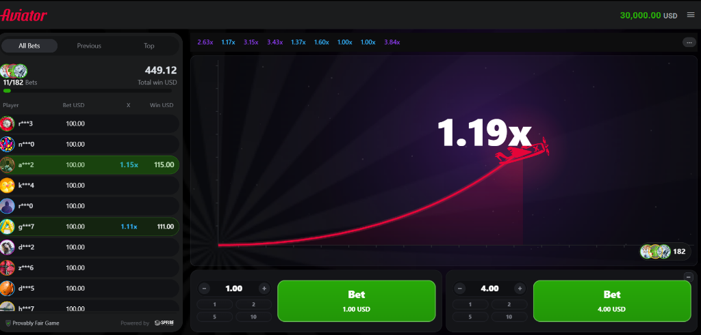

# 🚀 Aviator Clone — High-Performance Engine & Seamless Wallet Integration

> ⚠️ **Disclaimer / Notice**: This project is an authentic, full-featured **1:1 copy / replica clone of the popular Aviator crash game by SPRIBE**. It was engineered for technical demonstration, iGaming platform aggregation, and high-performance simulation.

A high-performance Aviator game clone built with **Node.js Express**, **Real-Time WebSockets**, **Native SQLite in WAL (Write-Ahead Logging) mode**, and an authentic **PixiJS v8** Canvas frontend.

This project includes a complete **Seamless Wallet API integration**, an administrative session generator producing direct player launch URLs, a real-time **Admin Dashboard (`/admin`)** with live crash multiplier controls, and a cryptographically verifiable **Provably Fair (SHA-256)** audit ledger.

---

<p align="center">
  
  <br />
  <em>Live Flight Gameplay: Dual betting panels, real-time multiplier curve, community bets feed, and responsive HUD.</em>
</p>

---

## 📑 Table of Contents
1. [General Architecture](#-general-architecture)
2. [Seamless Wallet API Integration](#-seamless-wallet-api-integration)
3. [Player Session Mechanics](#-player-session-mechanics)
4. [Admin Console (/admin)](#-admin-console-admin)
5. [High-Performance SQLite Database](#-high-performance-sqlite-database)
6. [Real-Time WebSocket Protocol (/ws)](#-real-time-websocket-protocol-ws)
7. [How to Run](#-how-to-run)
8. [Provably Fair Algorithm (SHA-256)](#-provably-fair-algorithm-sha-256)
9. [Project Directory Structure](#-project-directory-structure)
10. [Legal Disclaimer & Terms of Use](#-legal-disclaimer--terms-of-use)

---

## 🏛 General Architecture

```
┌─────────────────────────────────────────────────────────────┐
│                     CASINO / OPERATOR                       │
│    (Generates player session via Seamless API or Admin)     │
└──────────────────────────────┬──────────────────────────────┘
                               │ POST /api/seamless/session
                               ▼
┌─────────────────────────────────────────────────────────────┐
│                   NODE.JS EXPRESS BACKEND                   │
│  - Express REST API (Seamless, Session, Admin, Health)      │
│  - WebSocket Server (/ws, 25 fps ticks, state broadcast)    │
│  - Crash Engine with Provably Fair & Crash Multiplier Force │
│  - Native SQLite with WAL Mode & Atomic ACID Transactions   │
└──────────────────────────────┬──────────────────────────────┘
                               │ Launch URL: /?token=...
                               ▼
┌─────────────────────────────────────────────────────────────┐
│                 FRONTEND PIXIJS V8 (CANVAS)                 │
│  - Official Spribe & UFC Official Partners topbar layout    │
│  - Dual Betting Panels, Auto-Bet, Auto-Cashout              │
│  - Real-time synchronization via WebSocket & REST API       │
│  - Autonomous offline fallback if server is disconnected    │
└─────────────────────────────────────────────────────────────┘
```

---

## 💳 Seamless Wallet API Integration

The Seamless API is specifically structured to interface with iGaming aggregators, online casinos, and sportsbooks with zero round-trip overhead.

### 1. Create Player Session (Launch Session)
Authenticates or registers the player into the local ledger, establishes their balance, and generates a secure session token along with a ready-to-render launch URL for iframes and WebViews.

* **Endpoint**: `POST /api/seamless/session`
* **Content-Type**: `application/json`

**Request Payload:**
```json
{
  "playerId": "usr_bet_9988",
  "username": "PilotVIP",
  "currency": "USD",
  "balance": 1500.00,
  "operatorId": "operator_alpha",
  "returnUrl": "https://mycasino.com/lobby"
}
```
*(Also supports alternative field keys: `external_player_id`, `initial_balance`, `operator_id`, `return_url`)*.

**Success Response (200 OK):**
```json
{
  "success": true,
  "token": "da29ab5758332e03009e511f55a6db5615c8e4ea12f0c69a",
  "launchUrl": "http://localhost/?token=da29ab5758332e03009e511f55a6db5615c8e4ea12f0c69a",
  "user": {
    "id": "usr_bet_9988",
    "username": "PilotVIP",
    "currency": "USD",
    "balance": 1500.00
  }
}
```

---

### 2. Real-Time Balance Query
Enables the aggregator or client application to inspect the real-time balance of any player by `playerId` or by session `token`.

* **Endpoint**: `GET /api/seamless/balance?token={TOKEN}` or `GET /api/seamless/balance?playerId={PLAYER_ID}`

**Response (200 OK):**
```json
{
  "success": true,
  "playerId": "usr_bet_9988",
  "balance": 1500.00,
  "currency": "USD",
  "username": "PilotVIP"
}
```

---

### 3. Debit / Credit Transactions (Atomic Financial Ledger)
Enables safe wallet debit and credit transactions backed by an immutable transaction audit log (`transactions`).

* **Endpoint**: `POST /api/seamless/transaction`
* **Content-Type**: `application/json`

**Debit Example (External wager / adjustment):**
```json
{
  "token": "da29ab5758332e03009e511f55a6db5615c8e4ea12f0c69a",
  "type": "DEBIT",
  "amount": 50.00,
  "referenceId": "bet_tx_77192"
}
```

**Credit Example (Payout / bonus reward):**
```json
{
  "playerId": "usr_bet_9988",
  "type": "CREDIT",
  "amount": 180.50,
  "referenceId": "win_tx_77192"
}
```

**Response (200 OK):**
```json
{
  "success": true,
  "playerId": "usr_bet_9988",
  "type": "DEBIT",
  "delta": -50.00,
  "balanceBefore": 1500.00,
  "balanceAfter": 1450.00
}
```

---

## 👤 Player Session Mechanics

1. **Via Seamless API**: The casino operator performs a `POST` request to `/api/seamless/session` and delivers the resulting `launchUrl` (`/?token=...`) directly to the player.
2. **Via Admin Console**: Operators can navigate to `/admin`, fill in the player's username, currency, and initial balance, and hit **"Generate Session & Game Link"** to create an instant launch link with 1-click clipboard copying.
3. **Direct Guest Access (Demo Fallback)**: If a user accesses the root game URL `http://localhost/` without any token, the server automatically provisions a demo guest account credited with **$30,000.00 USD**, allowing instant gameplay without manual setup.

---

## 🎛 Admin Console (/admin)

The real-time admin management console is accessible at `http://localhost/admin` featuring a sleek, responsive dark glassmorphism interface.

### Default Credentials:
* **Password**: `admin123` (configurable via the `ADMIN_PASSWORD` environment variable).

### Key Console Features:
* 📊 **Real-Time KPI Analytics**:
  * **Gross Gaming Revenue (GGR)**: Calculated dynamically as `Total Wagered - Total Paid Out`.
  * **Total Betting Volume**: Sum of all placed wagers.
  * **Real RTP vs Theoretical RTP**: Instant ratio comparison (actual payout rate vs 97% standard).
  * **Total Player Count & Completed Rounds**.
  * **Live Round Status Badge**: Real-time phase indicator (`BETTING`, `FLYING`, `CRASHED`) and active multiplier display.
* 🕹️ **Live Game Crash Controls (Crash Force)**:
  * Force the exact crash multiplier for the upcoming flight (e.g., `1.50`, `10.00`, or `1.00` for an immediate ground crash).
  * Fast 1-click presets: `1.00x`, `1.25x`, `2.00x`, `5.00x`, `10.00x`, and `Reset (Auto Provably Fair)`.
  * System-wide global RTP control (97% Spribe default, 95%, 90%, 85%).
  * Configurable betting countdown interval (`3s`, `5s`, `7s`).
* 🔗 **Player Session Generator**:
  * Manual player provisioning tool with custom Username, Currency (`USD`, `BRL`, `EUR`), and Starting Balance.
  * Instant launch URL generation with one-click copy and "Open Game" button.
* 📜 **Provably Fair Round Audit Ledger**:
  * Transparent table displaying past rounds, crash multipliers, round status, public SHA-256 commitment hashes, revealed `serverSeed`, and `nonce`.
* 📋 **Real-Time Bets Ledger**:
  * Real-time monitoring of all active and resolved player bets, wagers, cashout multipliers, and payouts.

---

## ⚡ High-Performance SQLite Database

The platform leverages Node.js native SQLite engine (`node:sqlite` / `DatabaseSync`) configured in **WAL (Write-Ahead Logging) mode**:
* Non-blocking reads and high-throughput concurrent write capabilities.
* Full ACID compliance with atomic balance updates to prevent race conditions and negative balances.
* Zero external native C++ build tool dependencies (`node-gyp`), ensuring flawless operation across Windows, Linux, and ultra-lightweight Docker Alpine images.

### Database Schema (`data/aviator.db`):
* `users`: `id` (PK), `username`, `currency`, `balance`, `created_at`, `updated_at`.
* `sessions`: `token` (PK), `user_id`, `operator_id`, `return_url`, `created_at`, `expires_at`.
* `rounds`: `id` (PK), `hash`, `server_seed`, `client_seed`, `nonce`, `crash_multiplier`, `status`, `created_at`, `ended_at`.
* `bets`: `id` (PK), `round_id`, `user_id`, `slot_index`, `amount`, `auto_cash_out`, `cashout_mult`, `win_amount`, `status` (`PLACED`, `WON`, `LOST`, `CANCELLED`).
* `transactions`: `id` (PK), `user_id`, `amount`, `type`, `reference_id`, `balance_before`, `balance_after`, `created_at`.
* `settings`: `key` (PK), `value`.

---

## 🌐 Real-Time WebSocket Protocol (/ws)

The WebSocket server provides ultra-low latency game state streaming and sub-millisecond bet processing.

* **Connection URL**: `ws://localhost/ws?token={TOKEN}`

### Server Broadcast Events:
* `hello`: Transmits player profile, verified balance, and active round state upon connection.
* `engine_tick`: High-frequency multiplier tick emitted at 25 fps during plane flight.
* `phase_change`: Broadcasts phase changes (`BETTING`, `FLYING`, `CRASHED`).
* `round_crashed`: Emitted upon crash, revealing the secret `server_seed` for Provably Fair verification.
* `bet_confirmed`: Instant wager confirmation with updated user balance.
* `cash_out_success`: Cashout event payload including winning multiplier, payout amount, and balance.
* `balance_update`: Real-time user balance synchronization.
* `live_bets_update`: Real-time wagers and cashouts from other players in the room.

### Client Actions:
* `place_bet`: `{ "action": "place_bet", "slot_index": 0, "amount": 10.0, "auto_cash_out": 2.0 }`
* `cancel_bet`: `{ "action": "cancel_bet", "bet_id": 123, "slot_index": 0 }`
* `cash_out`: `{ "action": "cash_out", "bet_id": 123, "slot_index": 0 }`

---

## 🚀 How to Run

### Option 1: Docker (Recommended for Production)

The Docker container runs on `node:22-alpine` serving the API, WebSockets, Admin Console, and static game files on port 80.

```bash
# Build and run the container
docker build -t aviator-game .
docker run -d -p 80:80 --name aviator-app aviator-game
```

Access:
* **Game**: [http://localhost](http://localhost)
* **Admin Console**: [http://localhost/admin](http://localhost/admin) *(Password: `admin123`)*

---

### Option 2: Local Node.js Execution

**Requirement**: Node.js v22.5.0 or newer.

```bash
# Install dependencies
npm install

# Start the server
npm start
```

The server binds to port 80 by default (or custom port via `PORT=3000 npm start`).

---

### Automated API Integration Test

Run the full end-to-end API test suite:

```bash
node scripts/test_api.mjs
```

---

## 🔒 Provably Fair Algorithm (SHA-256)

1. Prior to round start, the server generates a cryptographically secure `serverSeed` and broadcasts its SHA-256 hash (**Commitment Hash**):
   $$\text{Hash} = \text{SHA-256}(\text{serverSeed})$$
2. The crash multiplier is calculated deterministically before takeoff:
   $$\text{Outcome} = \text{HMAC-SHA256}(\text{serverSeed}, \text{clientSeed} : \text{nonce})$$
3. Mathematical distribution adheres to the authentic Aviator game curve:
   $$P(\text{Multiplier} \ge m) = \frac{\text{RTP}}{m}$$
4. Once the round crashes, the unhashed `serverSeed` is published to the Provably Fair ledger. Any player or independent auditor can recompute the hash to verify that the result was strictly predetermined.

---

## 📁 Project Directory Structure

```text
├── admin/                    Admin Web Console
│   └── index.html            Dark glassmorphism dashboard with KPIs, Live Control, and Audits
├── server/                   High-Performance Backend (Node.js Express)
│   ├── db.js                 Native SQLite layer with WAL mode and atomic balance ledger
│   ├── engine.js             Provably Fair crash engine & real-time round state machine
│   ├── index.js              HTTP Server, Express routes, and WebSocket Server (/ws)
│   └── routes/
│       ├── seamless.js       Seamless Wallet API (Sessions, Balance, Debit/Credit)
│       ├── session.js        Player session endpoints (/me, history)
│       └── admin.js          Administrative endpoints, KPIs, and crash multiplier control
├── src/                      Frontend PixiJS v8 Client
│   ├── core/
│   │   ├── engine.js         Client-side engine state synchronization
│   │   ├── game.js           Balance manager, dual betting slots, and auto-cashout logic
│   │   └── fair.js           Provably Fair math and client-side verification
│   ├── network/
│   │   └── client.js         WebSocket client and Seamless bridge
│   ├── view/                 PixiJS scene graph, shaders, plane flight, and betting HUD
│   └── main.js               Game bootstrapper
├── Dockerfile                Optimized Node.js 22 Alpine container setup
├── package.json              ES Module project definition and dependencies
└── README.md                 Comprehensive documentation & integration manual
```

---

## ⚖️ Legal Disclaimer & Terms of Use

> **CRITICAL NOTICE**: This repository, codebase, and accompanying documentation are developed and distributed **strictly and exclusively for educational, academic, research, and technical evaluation purposes**.

1. **Non-Affiliation & Intellectual Property**:
   * "Aviator" and associated trademarks, visual identity, logos, and game mechanics are the exclusive intellectual property of **SPRIBE OU** and its affiliates.
   * This project is an independent technical recreation and architecture proof-of-concept. It is **not affiliated with, endorsed by, sponsored by, or officially authorized by SPRIBE**.

2. **No Real-Money Gambling**:
   * This software does not operate as an active casino, sportsbook, or real-money gaming service.
   * Any currency symbols (e.g., USD, BRL, EUR) displayed in the demonstration are purely numerical credits for simulation and technical testing of the wallet engine.

3. **Disclaimer of Liability & Misuse**:
   * The author(s), developers, and contributors **expressly disclaim any and all liability** for any direct, indirect, incidental, or consequential damages resulting from the use, misuse, modification, redistribution, or deployment of this software.
   * **The author is not responsible for any misuse, commercial exploitation, illegal gambling operations, regulatory infractions, or financial losses caused by third parties.**
   * Any individual, entity, or organization deploying or utilizing this codebase assumes full and sole legal responsibility for ensuring compliance with all applicable local, national, and international laws, regulations, and gaming licensing requirements in their respective jurisdiction.

4. **"As-Is" Warranty**:
   * This project is provided on an **"AS IS" and "AS AVAILABLE"** basis, without warranties, guarantees, or conditions of any kind, whether express or implied, including but not limited to warranties of merchantability, fitness for a particular purpose, non-infringement, or system reliability.

** If you require authentic game licenses, register at https://games2api.xyz to browse our catalog of more than 16,000 original games available on demand. **
